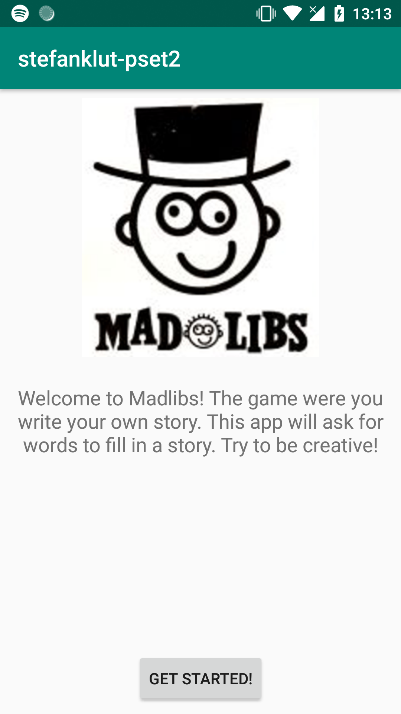
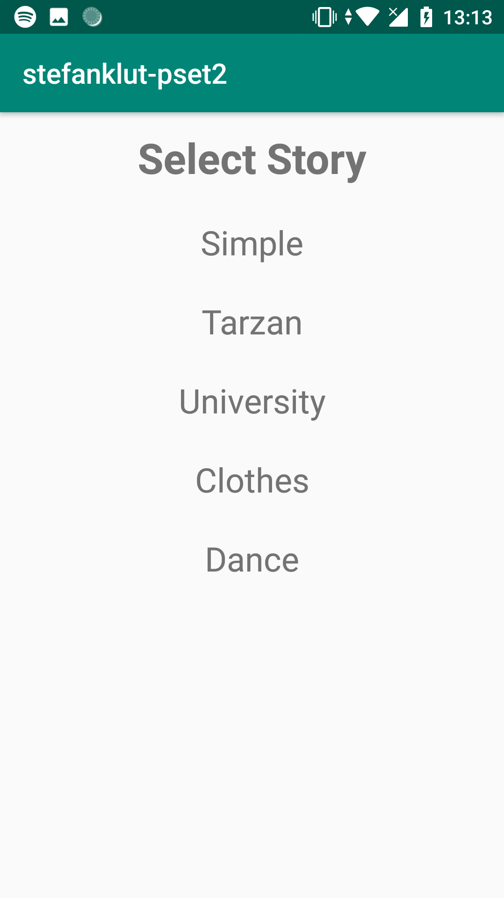
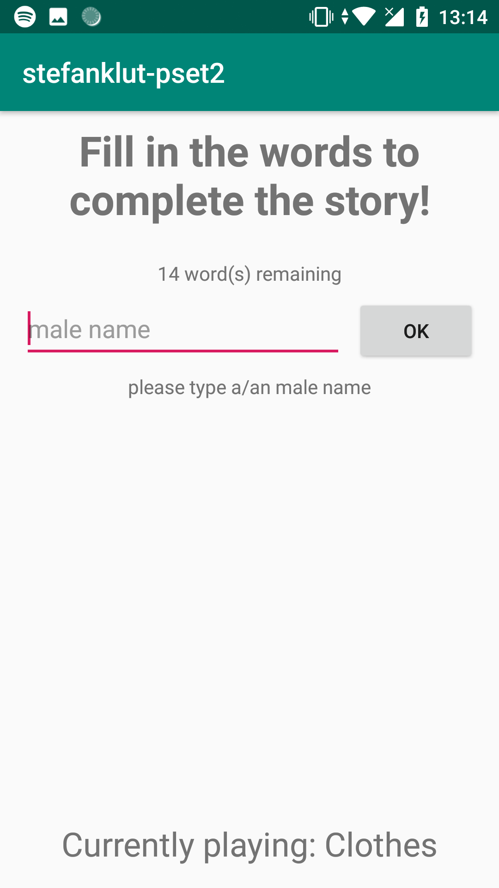
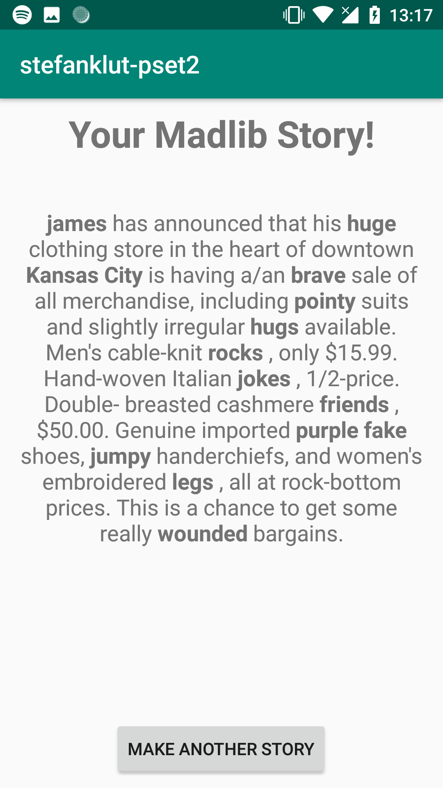
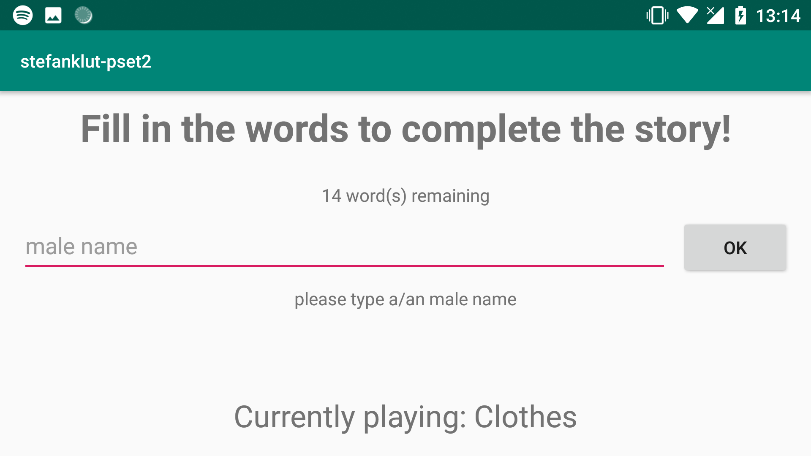

# stefanklutpset2: Madlibs

## Author info
**Name:** Stefan Klut  
**Studentnumber:** 11331720  
**email:** stefanklut12@gmail.com

## Description
An app that lets you play Madlibs by yourself. First select a story. 
After this the app will ask for words to put in this story. 
The app will specify what type of word is needed, and it will also show how many words are left.
After filling in all the words the user is presented with the finished story.
Pressing the back button will set you back to the story selection screen, 
so that you can play another game of Madlibs!

## Screenshots

### Opening Screen:

### Story selection screen:

### Input for words:

### Displayed Story:

### Landscape mode:

